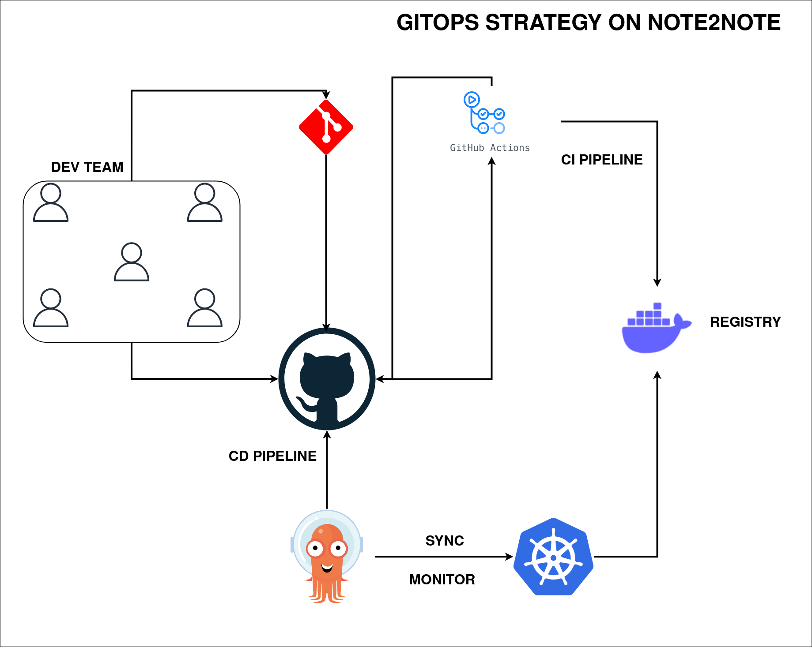
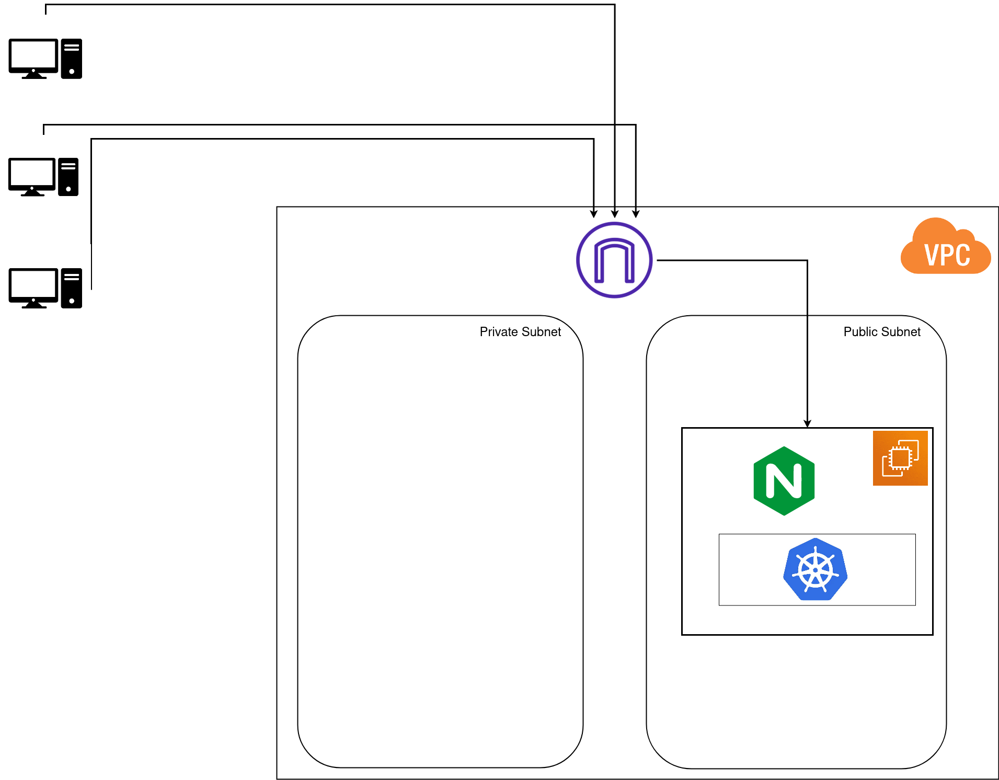

# DWM - 2023.2

Grupo da disciplina de Desenvolvimento WebMobile - Turma B do curso Ciência da Computação da Universidade Federal do Tocantins.

**Projeto:** Diário Online

## Conteúdos
- [Visão do Produto](#visao-do-produto)
- [Requisitos do Sistema (User Stories)](#requisitos-do-sistema-user-stories)
- [Entidades e Atributos](#entidades-e-atributos)
- [Documentação](#documentação)
- [Prototipação - Figma](#prototipação---figma)

## Visão do Produto

**Descrição:** O Note2Note é um aplicativo de diários online que permite aos usuários criar, gerenciar e compartilhar diários digitais de forma eficaz e segura, facilitando o registro de suas atividades e memórias pessoais.

**Para:** Usuários individuais e entusiastas da organização pessoal e memórias

**QUE:** Necessitam de uma solução digital para criar, gerenciar e compartilhar seus diários e registros diários de forma eficaz, tornando a experiência de documentar suas atividades e memórias pessoais mais significativa e segura.

O Note2Note é um aplicativo da categoria de organização pessoal e memórias **QUE:**

- Oferece a conveniência de documentar experiências diárias em diários personalizados.
- Permite a adição de imagens, vídeos e outros tipos de mídia aos registros diários.
- Permite a definição de níveis de privacidade para os diários.
- Oferece notificações personalizáveis para lembrar os usuários de escrever em seus diários.
- Está disponível como um site responsivo e um aplicativo Android.
- Garante a segurança dos dados e a privacidade dos usuários, proporcionando tranquilidade ao compartilhar memórias.

**AO CONTRÁRIO** de alternativas, como diários físicos ou aplicativos genéricos de notas, o Note2Note se diferencia pela:

- Foco dedicado em diários pessoais e memórias.
- Recursos avançados de mídia para enriquecer os registros.
- Opções de privacidade flexíveis.
- Notificações personalizadas para incentivar o registro constante.
- Disponibilidade multiplataforma.
- Segurança e privacidade aprimoradas.

## Requisitos do Sistema (User Stories)

1. **Registro e Autenticação**
   - Como um usuário, desejo poder me registrar e criar uma conta para acessar o sistema.

2. **Registro e Autenticação**
   - Como um usuário, desejo poder fazer login de forma segura em minha conta para acessar minhas informações pessoais.

3. **Registro e Autenticação**
   - Como um usuário, desejo ter a opção de recuperar minha senha caso a esqueça.

4. **Criação de Diário**
   - Como um usuário, desejo criar múltiplos diários para organizar minhas anotações.

5. **Criação de Diário**
   - Como um usuário, desejo poder dar um nome e uma descrição a cada um dos meus diários.

6. **Criação de Diário**
   - Como um usuário, desejo poder definir a privacidade dos meus diários, escolhendo entre público, privado ou compartilhado com outros usuários.

7. **Criação de Diário**
   - Como um usuário, desejo poder editar ou excluir meus diários conforme necessário.

8. **Registros Diários**
   - Como um usuário, desejo criar registros diários para documentar minhas atividades.

9. **Registros Diários**
   - Como um usuário, desejo que cada registro inclua um título, data e conteúdo de texto.

10. **Registros Diários**
    - Como um usuário, desejo a capacidade de anexar imagens, vídeos ou outros tipos de mídia aos meus registros.

11. **Registros Diários**
    - Como um usuário, desejo poder editar ou excluir os registros que criei.

12. **Registros Diários**
    - Como um usuário, desejo classificar meus registros por data e pesquisar por palavras-chave.

13. **Privacidade e Compartilhamento**
    - Como um usuário, desejo poder definir as configurações de privacidade de cada registro, escolhendo entre público, privado ou compartilhado com contatos específicos.

14. **Privacidade e Compartilhamento**
    - Como um usuário, desejo que os registros compartilhados sejam visíveis apenas para usuários autorizados.

15. **Privacidade e Compartilhamento**
    - Como um usuário, desejo que a plataforma garanta a segurança dos meus dados e minha privacidade.

16. **Notificações via Navegador**
    - Como um usuário, desejo poder configurar lembretes para escrever em meus diários diariamente ou em intervalos personalizados.

17. **Acesso Multiplataforma**
    - Como um usuário, desejo acessar a plataforma por meio de um site responsivo.

## Entidades e Atributos

    Usuário
        Atributos:
            ID (Chave Primária)
            Nome (Texto)
            Email (Texto)
            Senha (Texto)
        Relacionamento: Um usuário pode criar múltiplos diários.

    Diário
        Atributos:
            ID (Chave Primária)
            Nome (Texto)
            Descrição (Texto)
            Privacidade (Enum: Público, Privado, Compartilhado)
            Proprietário (Chave Estrangeira: ID do Usuário)
        Relacionamento:
            Um diário pertence a um único usuário.
            Um diário pode conter múltiplos registros diários.

    Registro Diário
        Atributos:
            ID (Chave Primária)
            Título (Texto)
            Data (Data/Hora)
            Conteúdo (Texto)
            Tipo de Mídia (Enum: Texto, Imagem, Vídeo, Outro)
            Arquivo de Mídia (Binário, para armazenar imagens, vídeos, etc.)
            Privacidade (Enum: Público, Privado, Compartilhado)
            Autor (Chave Estrangeira: ID do Usuário)
            Diário Associado (Chave Estrangeira: ID do Diário)
        Relacionamento:
            Um registro diário pertence a um único diário.
            Um registro diário é escrito por um único usuário.

    Compartilhamento
        Atributos:
            ID (Chave Primária)
            Tipo de Compartilhamento (Enum: Usuário Específico, Grupo)
            Usuário Compartilhado (Chave Estrangeira: ID do Usuário)
            Diário Compartilhado (Chave Estrangeira: ID do Diário)
        Relacionamento:
            Um compartilhamento pode ser de um diário com um usuário específico ou com um grupo de usuários.


## Documentação

### Usuário

- #### Criar conta (Sign Up)
      Permite a criação de um usuário.  
      Método: POST  
      Endpoint: /users/signup

        Responses:
         - 409: Details are not correct

      JSON Example
        {
          "userName": "usuarioteste",
          "email": "email@teste.com",
          "senha": "senhateste@123"
         }
      

- #### Entrar na conta (Log in)
      Permite que o usuário acesse sua conta.  
      Método: POST  
      Endpoint: /users/login

        **Responses:**
         - 401: Authentication failed

- #### Sair da conta (Log out)
      Permite que o usuário acesse sua conta.  
      Método: GET  
      Endpoint: /users/logout

        **Responses:**
         - 200: User logged out successfully

- #### Lista de Usuários (apenas para desenvolvimento)
      Permite visualizar todos os usuários.
      Método: GET  
      Endpoint: /users/users
  
- #### Encontrar usuário
      Permite encontrar um usuário.  
      Método: GET  
      Endpoint: /users/:id

      **Responses:**
         - 404: message: `Cannot find User with id=${id}.`
         - 500: message: "Error retrieving User with id=" + id


- #### Atualizar nome de usuário
      Permite atualizar o nome do usuário.   
      Método: PUT  
      Endpoint: /users/:id/updateName

      **Responses:**
         - 404: message: `Cannot update User with id=${id}. Maybe User was not found or req.body is empty!`
         - 500: message: "Error updating User with id=" + id

- #### Atualizar email de usuário 
      Permite atualizar o email do usuário.
      Método: PUT  
      Endpoint: /users/:id/updateUserEmail

      **Responses:**
         - 200: message: "Email updated successfully"
         - 404: message: "User not found"
         - 409: message: "Email already exists in the database."
         - 500: message: "Internal server error"
  
- #### Apagar usuário
      Permite apagar o usuário.  
      Método: DELETE  
      Endpoint: /users/:id

      **Responses:**
         - 404: message: `Cannot delete User with id=${id}. Maybe User was not found!`
         - 500: message: "Could not delete User with id=" + id

### Diário

- #### Criar Diário
      Cria um novo Diário
      Método: POST
      Endpoint: /diario
      **Resoinses:**
      - 201: message: 'Diary created successfully'
      - 409: message: "Details are not correct"
  
- #### Lista de todos os diários (apenas para o desenvolvimento)
      Lista todos os Diários 
      Método: GET
      Endpoint: /diario
      **Resoinses:**
      - 200: Returns the list of journals.
      - 500: message:  "An error occurred while retrieving the journals."
  
- #### Encontrar Diário privado
      Retorna um diário com o ID especificado.
      Método: GET
      Endpoint: /diario/:id
      **Resoinses:**
      - 200: message: Returns the corresponding journal.
      - 401: message: User not logged in or has not authorized cookies, please log in and accept cookies.
      - 403: message: This diary does not belong to this user.
      - 404: message: Cannot find Diario with id=${id}.

- #### Atualizar Registro Diário 
      Atualiza um diário com o ID especificado.
      Método: PUT
      Endpoint: /diario/:id
      **Resoinses:**
      - 200: message: "Diario was updated successfully."
      - 404: message: `Cannot update Diario with id=${id}. Maybe Diario was not found or req.body is empty!`
      - 500: message: "Error updating Diario with id=" + id.
  
- #### Deleta Registro Diário 
      Deleta um diário com o ID especificado.
      Método: DELETE
      Endpoint: /diario/:id
      **Resoinses:**
      - 200: message: "Diario was deleted successfully!"
      - 404: message: `Cannot delete Diario with id=${id}. Maybe Diario was not found!`
      - 500: message: "Could not delete Diario with id=" + id

### Registro Diário

- #### Criar Registro Diário
      Cria um novo registro diário
      Método: POST
      Endpoint: /registroDiario
      **Resoinses:**
      - 201: message: 'Record created successfully'
      - 409: message: "Details are not correct"
  
- #### Lista de todos os registros diário (apenas para o desenvolvimento)
      Lista todos os Registros 
      Método: GET
      Endpoint: /registroDiario
      **Resoinses:**
      - 200: Returns the list of daily records.
      - 500: message:  "An error occurred while retrieving registered journals."
  
- #### Encontrar Registro Diário privado
      Retorna um registro diário com o ID especificado.
      Método: GET
      Endpoint: /registroDiario/:id
      **Resoinses:**
      - 200: message: Returns the corresponding daily record.
      - 401: message: User is not logged in or has not authorized cookies.
      - 403: message: The record does not belong to this user.
      - 404: message: Associated record or journal not found.

- #### Atualizar Registro Diário 
      Atualiza um registro diário com o ID especificado.
      Método: PUT
      Endpoint: /registroDiario/:id
      **Resoinses:**
      - 200: message: "Registry was updated successfully."
      - 404: message: `Unable to update Registry with id=${id}. Maybe the Registry was not found or req.body is empty!`
      - 500: message: "Error updating Registry with id=" + id.
  
- #### Deleta Registro Diário 
      Deleta um registro diário com o ID especificado.
      Método: DELETE
      Endpoint: /registroDiario/:id
      **Resoinses:**
      - 200: message: "Registro wsa deleted successfully!"
      - 404: message: `It is not possible to delete the Journal Record with id=${id}. Perhaps the Registry was not found!`
      - 500: message: "Unable to delete record with id=" + id

### Compartilhamento

- #### Compartilhar Diário
      Criar Compartilhamento de Diário
      Cria um novo compartilhamento de diário.
      Método: POST
      Endpoint: /compartilharDiario
      Respostas:
      201: Retorna o compartilhamento criado com sucesso.
      409: Indica que os detalhes não estão corretos.

- #### Lista de todos os compartilhamentos de diário (apenas para desenvolvimento)
      Lista todos os compartilhamentos de diário.
      Método: GET
      Endpoint: /compartilharDiario
      Respostas:
      200: Retorna a lista de todos os registros de compartilhamento.
      500: Indica que ocorreu um erro ao recuperar os registros de diário compartilhados.

- #### Encontrar Compartilhamento de Diário
      Retorna um compartilhamento de diário com o ID especificado.
      Método: GET
      Endpoint: /compartilharDiario/:id
      Respostas:
      200: Retorna o registro de compartilhamento de diário correspondente.
      404: Indica que o registro de compartilhamento de diário com o ID especificado não foi encontrado.
      500: Indica um erro ao recuperar o registro de compartilhamento de diário.

- #### Atualizar Compartilhamento de Diário
      Atualiza um compartilhamento de diário com o ID especificado.
      Método: PUT
      Endpoint: /compartilharDiario/:id
      Respostas:
      200: Indica que o registro foi atualizado com sucesso.
      404: Indica que não foi possível atualizar o registro com o ID especificado, talvez porque não tenha sido encontrado ou o corpo da requisição está vazio.
      500: Indica um erro ao atualizar o registro de compartilhamento de diário.
- #### Deletar Compartilhamento de Diário
      Deleta um compartilhamento de diário com o ID especificado.     
      Método: DELETE
      Endpoint: /compartilharDiario/:id
      Respostas:
      200: Indica que o registro foi deletado com sucesso.
      404: Indica que não foi possível deletar o registro de compartilhamento de diário com o ID especificado, talvez porque não tenha sido encontrado.
      500: Indica um erro ao deletar o registro de compartilhamento de diário.
  
## Prototipação - Figma

Prototipos desenvolvidos na plataforma Figma, para layouts desktop e mobile:

### Tela de Login - Entrar:


### Tela de SignUp - Criar Conta:


### Tela de Login - Entrar (Mobile):


### Tela de SignUp - Criar Conta (Mobile):


## Infra Discovery
   Atualmente nossa infraestrutura se baseia no cloud provider AWS, usamos IAC(infra as code) utilizando o Terraform.  
   Como um app que segue premissas Cloud-native.
   ### GITOPS STRATEGY
   
   ### AWS
   


# Conectar ao banco de dados local
1 - Para se conectar ao banco de dados local 
utilize algum SGDB de sua preferencia (Sistema de gerenciamento de banco de dados)
podendo ser DBeave,pgAdmin, entre outros.

2 - ## Credenciais 
```bash
  HOST: localhost
  Porta: 5432
  Baco de dados:notedb
  Usuario: postgres
  Senha:Kaju
```

3 - Abra o docker desktop, verifice se o container postgress esta rodando
após isso tente conectar ao banco de dados. O banco de dados estará vazio.


## *Possiveis erros:*

Caso você tenha o postgres instalado na sua maniquina ele estará tambem
usando a porta 5232, resultando em conflito caso tente se conectar.

4 - abre seu cmd como administrador e rode o comando: 
```bash
  netstat -ano | findstr :5432
```


5 - "mate" o processo com os dois endereços da ulima coluna

6 - execute os seguintes comando: 
```bash
  taskkill /PID **** /F 
```
```bash
  taskkill /PID ***** /F
```
Tente se conectar novamente ao banco de dados.
