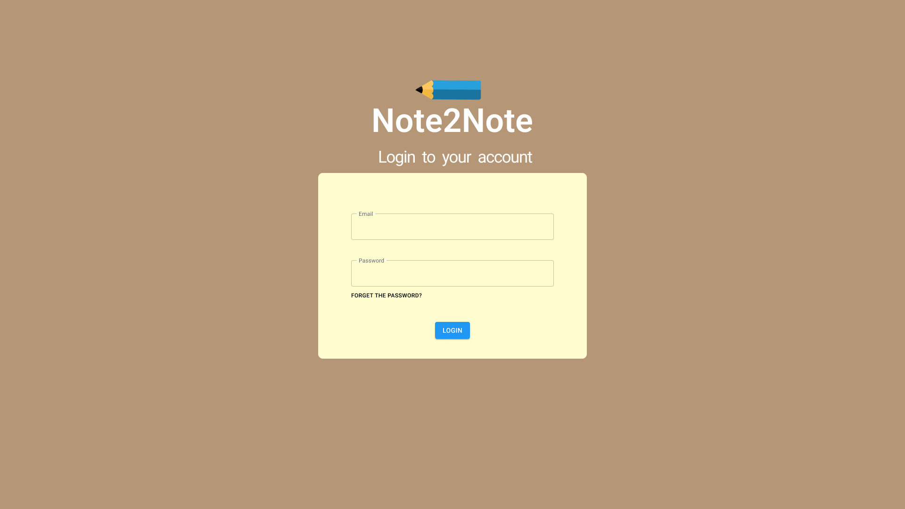
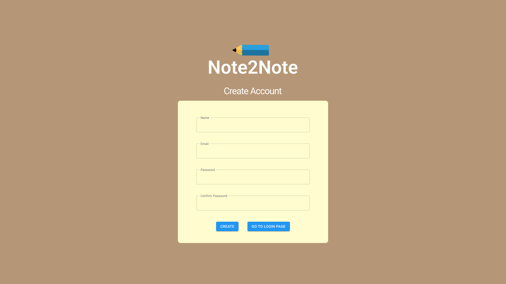
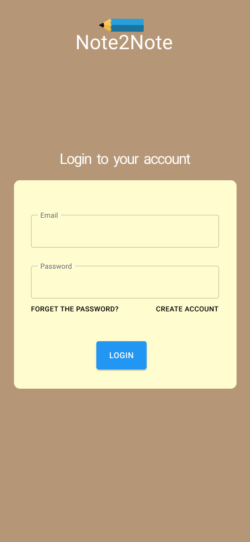
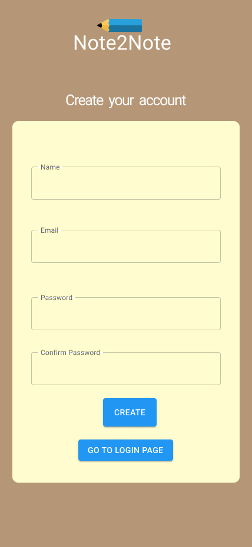

# DWM - 2023.2

Grupo da disciplina de Desenvolvimento WebMobile - Turma B do curso Ciência da Computação da Universidade Federal do Tocantins.

**Projeto:** Diário Online

## Conteúdos
- [Visão do Produto](#visao-do-produto)
- [Requisitos do Sistema (User Stories)](#requisitos-do-sistema-user-stories)
- [Entidades e Atributos](#entidades-e-atributos)
- [Documentação](#documentação)
- [Prototipação - Figma](#prototipação---figma)

## Visão do Produto

**Descrição:** O Note2Note é um aplicativo de diários online que permite aos usuários criar, gerenciar e compartilhar diários digitais de forma eficaz e segura, facilitando o registro de suas atividades e memórias pessoais.

**Para:** Usuários individuais e entusiastas da organização pessoal e memórias

**QUE:** Necessitam de uma solução digital para criar, gerenciar e compartilhar seus diários e registros diários de forma eficaz, tornando a experiência de documentar suas atividades e memórias pessoais mais significativa e segura.

O Note2Note é um aplicativo da categoria de organização pessoal e memórias **QUE:**

- Oferece a conveniência de documentar experiências diárias em diários personalizados.
- Permite a adição de imagens, vídeos e outros tipos de mídia aos registros diários.
- Permite a definição de níveis de privacidade para os diários.
- Oferece notificações personalizáveis para lembrar os usuários de escrever em seus diários.
- Está disponível como um site responsivo e um aplicativo Android.
- Garante a segurança dos dados e a privacidade dos usuários, proporcionando tranquilidade ao compartilhar memórias.

**AO CONTRÁRIO** de alternativas, como diários físicos ou aplicativos genéricos de notas, o Note2Note se diferencia pela:

- Foco dedicado em diários pessoais e memórias.
- Recursos avançados de mídia para enriquecer os registros.
- Opções de privacidade flexíveis.
- Notificações personalizadas para incentivar o registro constante.
- Disponibilidade multiplataforma.
- Segurança e privacidade aprimoradas.

## Requisitos do Sistema (User Stories)

1. **Registro e Autenticação**
   - Como um usuário, desejo poder me registrar e criar uma conta para acessar o sistema.

2. **Registro e Autenticação**
   - Como um usuário, desejo poder fazer login de forma segura em minha conta para acessar minhas informações pessoais.

3. **Registro e Autenticação**
   - Como um usuário, desejo ter a opção de recuperar minha senha caso a esqueça.

4. **Criação de Diário**
   - Como um usuário, desejo criar múltiplos diários para organizar minhas anotações.

5. **Criação de Diário**
   - Como um usuário, desejo poder dar um nome e uma descrição a cada um dos meus diários.

6. **Criação de Diário**
   - Como um usuário, desejo poder definir a privacidade dos meus diários, escolhendo entre público, privado ou compartilhado com outros usuários.

7. **Criação de Diário**
   - Como um usuário, desejo poder editar ou excluir meus diários conforme necessário.

8. **Registros Diários**
   - Como um usuário, desejo criar registros diários para documentar minhas atividades.

9. **Registros Diários**
   - Como um usuário, desejo que cada registro inclua um título, data e conteúdo de texto.

10. **Registros Diários**
    - Como um usuário, desejo a capacidade de anexar imagens, vídeos ou outros tipos de mídia aos meus registros.

11. **Registros Diários**
    - Como um usuário, desejo poder editar ou excluir os registros que criei.

12. **Registros Diários**
    - Como um usuário, desejo classificar meus registros por data e pesquisar por palavras-chave.

13. **Privacidade e Compartilhamento**
    - Como um usuário, desejo poder definir as configurações de privacidade de cada registro, escolhendo entre público, privado ou compartilhado com contatos específicos.

14. **Privacidade e Compartilhamento**
    - Como um usuário, desejo que os registros compartilhados sejam visíveis apenas para usuários autorizados.

15. **Privacidade e Compartilhamento**
    - Como um usuário, desejo que a plataforma garanta a segurança dos meus dados e minha privacidade.

16. **Notificações**
    - Como um usuário, desejo poder configurar lembretes para escrever em meus diários diariamente ou em intervalos personalizados.

17. **Notificações**
    - Como um usuário, desejo que os lembretes possam ser enviados por e-mail ou notificações push.

18. **Acesso Multiplataforma**
    - Como um usuário, desejo acessar a plataforma por meio de um site responsivo.

19. **Acesso Multiplataforma**
    - Como um usuário, desejo uma versão do aplicativo móvel para sistema Android para facilitar o acesso em dispositivos móveis.

## Entidades e Atributos

    Usuário
        Atributos:
            ID (Chave Primária)
            Nome (Texto)
            Email (Texto)
            Senha (Texto)
        Relacionamento: Um usuário pode criar múltiplos diários.

    Diário
        Atributos:
            ID (Chave Primária)
            Nome (Texto)
            Descrição (Texto)
            Privacidade (Enum: Público, Privado, Compartilhado)
            Proprietário (Chave Estrangeira: ID do Usuário)
        Relacionamento:
            Um diário pertence a um único usuário.
            Um diário pode conter múltiplos registros diários.

    Registro Diário
        Atributos:
            ID (Chave Primária)
            Título (Texto)
            Data (Data/Hora)
            Conteúdo (Texto)
            Tipo de Mídia (Enum: Texto, Imagem, Vídeo, Outro)
            Arquivo de Mídia (Binário, para armazenar imagens, vídeos, etc.)
            Privacidade (Enum: Público, Privado, Compartilhado)
            Autor (Chave Estrangeira: ID do Usuário)
            Diário Associado (Chave Estrangeira: ID do Diário)
        Relacionamento:
            Um registro diário pertence a um único diário.
            Um registro diário é escrito por um único usuário.

    Compartilhamento
        Atributos:
            ID (Chave Primária)
            Tipo de Compartilhamento (Enum: Usuário Específico, Grupo)
            Usuário Compartilhado (Chave Estrangeira: ID do Usuário)
            Diário Compartilhado (Chave Estrangeira: ID do Diário)
        Relacionamento:
            Um compartilhamento pode ser de um diário com um usuário específico ou com um grupo de usuários.

## Documentação

### Usuário

- #### Criar conta (Sign Up)
      Permite a criação de um usuário.  
      Método: POST  
      Endpoint: /users/signup

        Responses:
         - 409: Details are not correct

      JSON Example
        {
          "userName": "usuarioteste",
          "email": "email@teste.com",
          "senha": "senhateste@123"
         }
      

- #### Entrar na conta (Log in)
      Permite que o usuário acesse sua conta.  
      Método: POST  
      Endpoint: /users/login

        **Responses:**
         - 401: Authentication failed

- #### Sair da conta (Log out)
      Permite que o usuário acesse sua conta.  
      Método: GET  
      Endpoint: /users/logout

        **Responses:**
         - 200: User logged out successfully

- #### Lista de Usuários (apenas para desenvolvimento)
      Permite visualizar todos os usuários.
      Método: GET  
      Endpoint: /users/users
  
- #### Encontrar usuário
      Permite encontrar um usuário.  
      Método: GET  
      Endpoint: /users/:id

      **Responses:**
         - 404: message: `Cannot find User with id=${id}.`
         - 500: message: "Error retrieving User with id=" + id

- #### Atualizar nome de usuário
      Permite atualizar o nome do usuário.   
      Método: PUT  
      Endpoint: /users/:id/updateName

      **Responses:**
         - 404: message: `Cannot update User with id=${id}. Maybe User was not found or req.body is empty!`
         - 500: message: "Error updating User with id=" + id

- #### Atualizar email de usuário 
      Permite atualizar o email do usuário.
      Método: PUT  
      Endpoint: /users/:id/updateUserEmail

      **Responses:**
         - 200: message: "Email updated successfully"
         - 404: message: "User not found"
         - 409: message: "Email already exists in the database."
         - 500: message: "Internal server error"
  
- #### Apagar usuário
      Permite apagar o usuário.  
      Método: DELETE  
      Endpoint: /users/:id

      **Responses:**
         - 404: message: `Cannot delete User with id=${id}. Maybe User was not found!`
         - 500: message: "Could not delete User with id=" + id

### Diário

### Registro Diário

### Compartilhamento

## Prototipação - Figma

Prototipos desenvolvidos na plataforma Figma, para layouts desktop e mobile:

### Tela de Login - Entrar:

### Tela de SignUp - Criar Conta:

### Tela de Login - Entrar (Mobile):

### Tela de SignUp - Criar Conta (Mobile):

